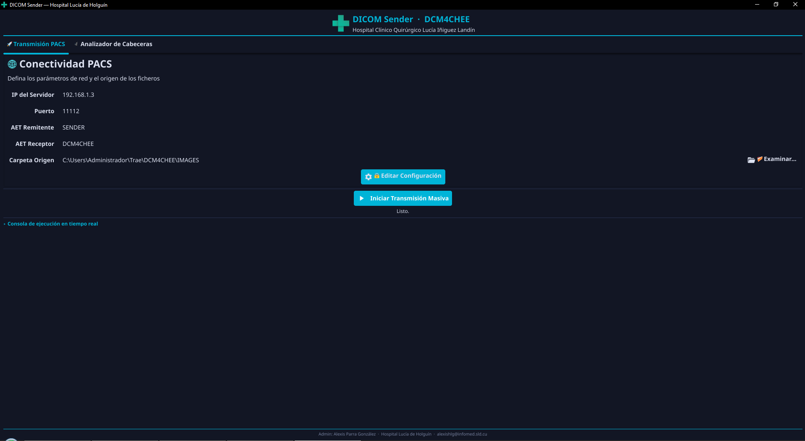
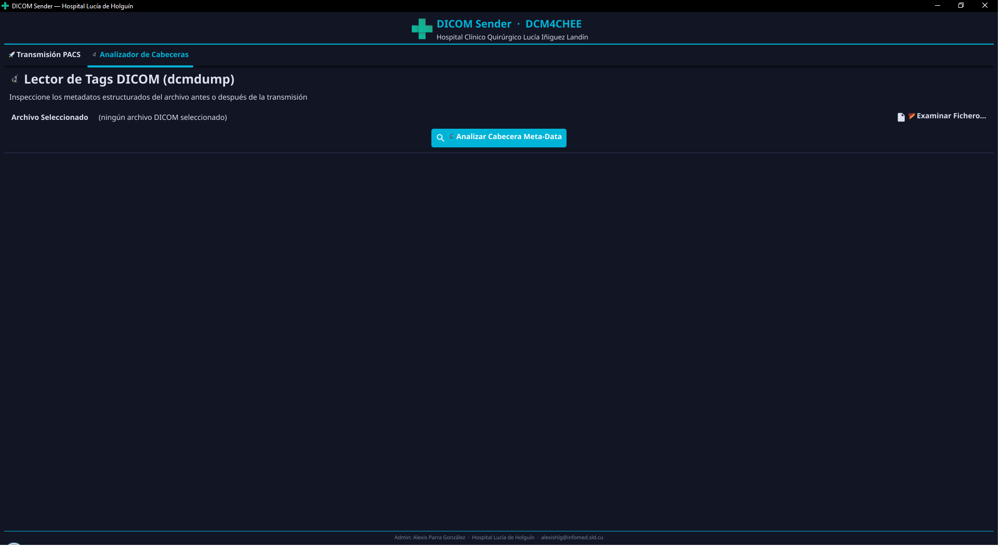

# DICOM Sender · DCM4CHEE

Aplicación de escritorio para **Windows** que facilita la **transmisión masiva de estudios DICOM** hacia un servidor PACS (por ejemplo **DCM4CHEE**) y la **inspección de metadatos** mediante las utilidades DCMTK. Interfaz gráfica construida con [Fyne](https://fyne.io/).

**Hospital Clínico Quirúrgico Lucía Iñiguez Landín** — Dpto. Informática.

---

## Capturas de pantalla

### Transmisión PACS

Configuración de conectividad (IP, puerto, AET remitente/receptor), carpeta de origen de los ficheros `.dcm`, consola de ejecución y arranque de la transmisión masiva.



### Analizador de cabeceras

Selección de un fichero DICOM y análisis de tags relevantes (paciente, estudio, modalidad, etc.) antes o después de la transmisión.



---

## Características

- **Transmisión PACS**: corrección de UIDs con `dcmodify`, limpieza de respaldos `.bak` y envío con `dcmsend` hacia el host y AET configurados.
- **Analizador de cabeceras**: lectura estructurada con `dcmdump` de los campos más habituales en radiología.
- **Configuración protegida**: edición de IP, puerto y AET bajo contraseña de administración.
- **Tema oscuro** y flujo guiado con barra de progreso durante el envío.
- **Distribución en un solo `.exe`**: en tiempo de compilación se embebe la carpeta `bin` (ejecutables y DLL de DCMTK); en el primer uso se materializan en la caché de usuario para que el sistema pueda cargar las dependencias nativas.

---

## Requisitos

| Elemento | Detalle |
|----------|---------|
| Sistema operativo | **Windows** (64 bits recomendado) |
| Go | **1.22+** (solo para compilar desde código) |
| DCMTK | Binarios y DLL en la carpeta **`bin/`** del proyecto en el momento de **`go build`** (misma distribución que usa la aplicación en tiempo de ejecución) |

---

## Compilación

1. Clona el repositorio y coloca el árbol completo de **DCMTK para Windows** dentro de **`bin/`** (incluye `dcmdump.exe`, `dcmodify.exe`, `dcmsend.exe` y sus DLL).
2. Asegúrate de tener **`logo.ico`** en la raíz del proyecto (icono del ejecutable en el Explorador).
3. Ejecuta **`compilar.bat`**, que:
   - ejecuta `go mod tidy`;
   - genera **`rsrc_windows_<GOARCH>.syso`** con [rsrc](https://github.com/akavel/rsrc) a partir de `logo.ico`;
   - compila **`DicomSender.exe`** sin ventana de consola (`-H windowsgui`).

Compilación manual equivalente:

```powershell
go mod tidy
go run github.com/akavel/rsrc@v0.10.2 -ico logo.ico
go build -ldflags="-H windowsgui -s -w" -o DicomSender.exe .
```

---

## Uso rápido

1. Ejecuta **`DicomSender.exe`**.
2. En **Transmisión PACS**, revisa o desbloquea con la clave de administración la configuración de red y AET; elige la carpeta con los `.dcm`.
3. Pulsa **Iniciar transmisión masiva** y revisa la consola.
4. En **Analizador de cabeceras**, elige un fichero y ejecuta el análisis.

La carpeta por defecto de imágenes suele apuntar a **`IMAGES`** junto al ejecutable; puedes cambiarla con **Examinar**.

---

## Notas técnicas

- Los binarios embebidos se descomprimen bajo el directorio de caché del usuario (por ejemplo `%LocalAppData%\DicomSender\embedded-bin` en Windows). Si actualizas DCMTK, recompila para sustituir los recursos embebidos.


---

## Créditos

**Desarrollo:** Alexis Parra González · Hospital Lucía de Holguín · [alexishlg@infomed.sld.cu](mailto:alexishlg@infomed.sld.cu)

---

## Licencia

Indica aquí la licencia del proyecto si aplica (por ejemplo MIT, propietaria del centro, etc.).
